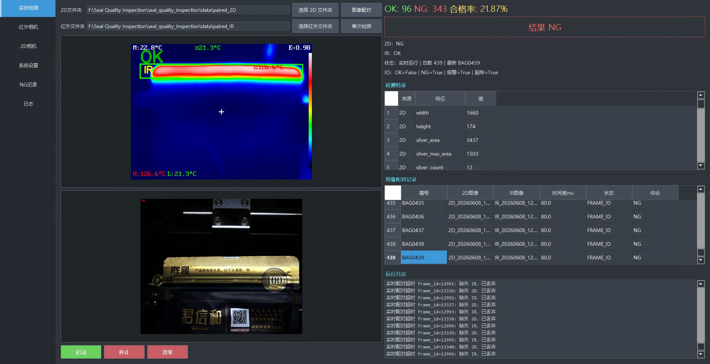
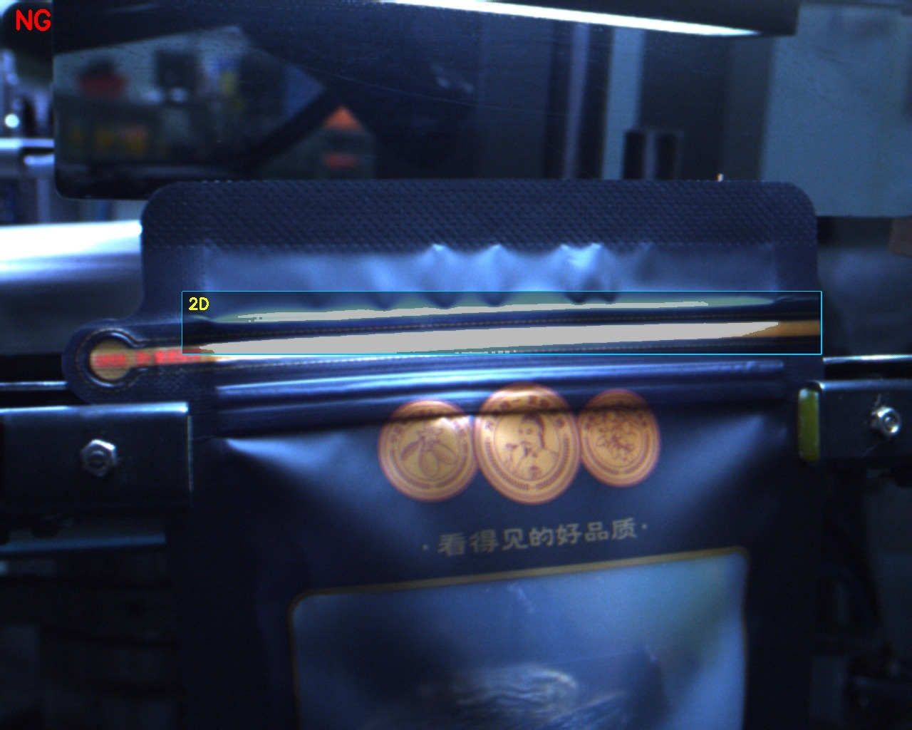
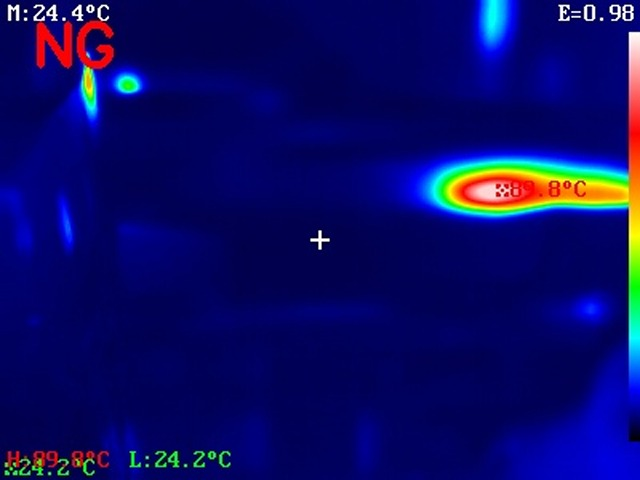
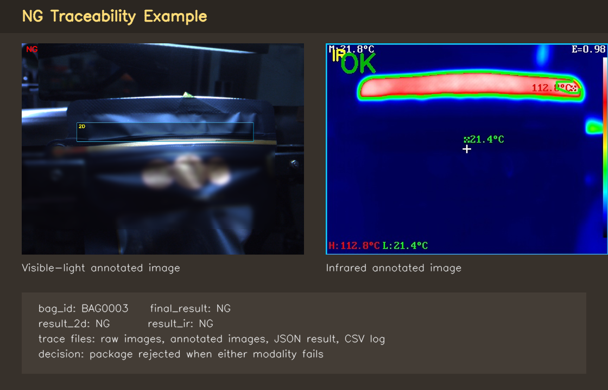
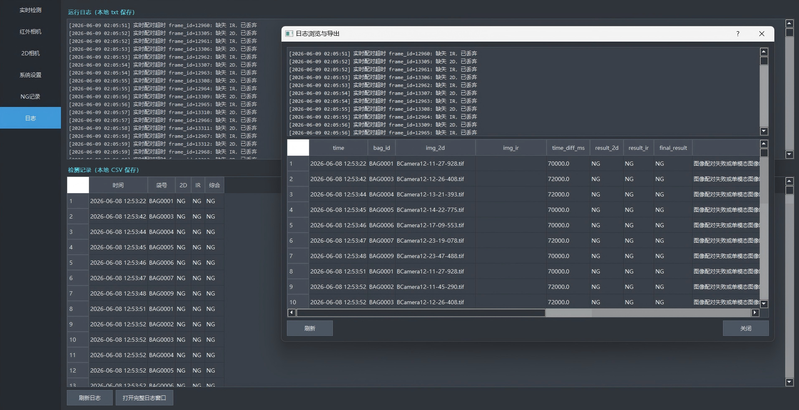

# Multimodal Seal Quality Inspection System


An industrial vision prototype for automatic heat-seal quality inspection. The system combines 2D visible-light images and infrared images to match image pairs, locate seal regions, extract quality-related features, classify each package as OK or NG, and save traceable inspection records.

This project was developed as a practical image-processing system rather than a single algorithm demo. It includes a PyQt5 desktop interface, configurable inspection thresholds, batch processing, NG image traceability, CSV/JSON logging, and simulated IO signals for production-line integration.

## Preview



The desktop interface provides real-time inspection, 2D/IR image review, feature tables, package-level decisions, local logs, and NG record browsing.

## Highlights

- Multimodal inspection using both visible-light and infrared images.
- Timestamp-based pairing between 2D and IR images.
- Automatic and configurable ROI detection for seal regions.
- 2D defect analysis based on silver-edge detection and ROI measurements.
- Infrared seal analysis based on segmentation, geometry, roughness, mean temperature, and temperature uniformity.
- Package-level decision logic: a package is accepted only when both 2D and IR inspections pass.
- PyQt5 industrial-style UI for manual review, real-time folder polling, configuration, logs, and NG browsing.
- Traceable outputs including raw NG images, annotated images, JSON results, and CSV logs.
- Simulated OK/NG/ALARM/REJECT IO signals for future hardware integration.

## System Workflow

```text
2D images + IR images
        |
        v
Timestamp parsing and pair matching
        |
        v
ROI localization and feature extraction
        |
        v
2D inspection + IR inspection
        |
        v
Package-level OK/NG decision
        |
        v
Annotated images, JSON records, CSV logs, and IO status
```

## Repository Structure

```text
.
|-- main.py                    # Command-line entry point and UI launcher
|-- config.json                # Inspection thresholds, ROI settings, paths, and runtime options
|-- requirements.txt           # Python dependencies
|-- modules/                   # Core inspection logic
|   |-- detector_2d.py          # Visible-light inspection
|   |-- detector_ir.py          # Infrared inspection
|   |-- pair_matcher.py         # 2D/IR timestamp pairing
|   |-- inspection_service.py   # End-to-end inspection pipeline
|   |-- logger.py               # CSV/JSON/result saving
|   `-- ...
|-- ui/                        # PyQt5 desktop interface
|-- data/                      # Local inspection images and a small public demo dataset
`-- result/                    # Generated inspection outputs
```

## Installation

Python 3.10 or newer is recommended.

```bash
pip install -r requirements.txt
```

The main dependencies are:

- OpenCV
- NumPy
- Pandas
- PyQt5

## Run the Desktop UI

```bash
python main.py
```

The UI supports image inspection, folder polling, result visualization, threshold configuration, log viewing, and NG record browsing.

## Run Batch Inspection

The command below assumes that paired image folders are available locally:

```bash
python main.py --batch --folder-2d data/paired_2D --folder-ir data/paired_IR
```

This repository includes a small curated demo dataset under:

```text
data/demo/paired_2D
data/demo/paired_IR
```

and tested with:

```bash
python main.py --batch --folder-2d data/demo/paired_2D --folder-ir data/demo/paired_IR
```

To test the algorithm without writing result files:

```bash
python main.py --batch --no-save
```

Example output:

```text
Detected 75 bag records
BAG0001: 2D=NG, IR=NG, FINAL=NG, ...
BAG0004: 2D=OK, IR=OK, FINAL=OK, OK
```

## Image Naming Convention

The recommended image naming format is:

```text
2D_20240301_153012_125.jpg
IR_20240301_153012_180.jpg
```

The system parses timestamps in the `YYYYMMDD_HHMMSS_mmm` format. If no timestamp is found in the file name, it falls back to the file modification time.

## Configuration

Most inspection parameters are stored in `config.json`, including:

- 2D and IR ROI settings
- segmentation mode and thresholds
- geometric and temperature acceptance ranges
- maximum allowed 2D silver-edge area and ratio
- pairing time tolerance
- output directories
- simulated IO signal names and reject duration

This makes the system easy to recalibrate for different image resolutions, lighting conditions, seal materials, and production requirements.

## Outputs

When saving is enabled, the system generates:

- annotated inspection images
- NG raw images
- per-package JSON result files
- CSV inspection logs
- simulated IO states

For a public GitHub repository, it is better to upload only a small set of representative demo images and result examples instead of the full production dataset.

Example inspection results:

| Visible-light inspection | Infrared inspection |
| --- | --- |
|  |  |

NG traceability and log review:

| NG browser | Log window |
| --- | --- |
|  |  |

## Data Availability

The full local dataset and generated inspection results are not intended to be committed to the public repository. The `.gitignore` file excludes most of `data/` and all of `result/` by default, while allowing the small public demo dataset under `data/demo/`.

## Suggested GitHub Presentation

For a stronger project page, add a few selected images under `docs/images/`:

```text
docs/images/ui_runtime_detection.png
docs/images/2d_detection_example.jpg
docs/images/ir_detection_example.jpg
docs/images/ng_trace_example.jpg
docs/images/log_review_window.png
```

These images are referenced in the README preview and output sections. A screenshot of the UI and two annotated detection examples make the project much easier to understand at a glance.

## Technical Focus

This project demonstrates:

- classical computer vision for industrial inspection
- multimodal image matching and decision fusion
- configurable inspection pipelines
- desktop UI development with PyQt5
- inspection result traceability and production-oriented logging

## Notes

This repository is intended as a research and engineering prototype. For deployment on a real production line, the next steps would include hardware camera integration, real IO/PLC communication, larger-scale validation, and model/threshold calibration on more diverse defect samples.
